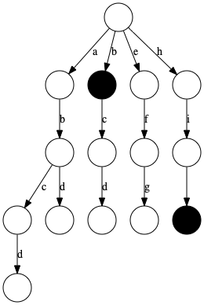

# Trie实现

## 1. 前缀🌲定义

Trie (发音为 "try") 或前缀树是一种树数据结构，用于检索字符串数据集中的键。这一高效的数据结构有多种应用：

* 自动补全

还有其他的数据结构，如平衡树和哈希表，使我们能够在字符串数据集中搜索单词。为什么我们还需要 Trie 树呢？尽管哈希表可以在 O(1)O(1) 时间内寻找键值，却无法高效的完成以下操作：

找到具有同一前缀的全部键值。
按词典序枚举字符串的数据集。
Trie 树优于哈希表的另一个理由是，随着哈希表大小增加，会出现大量的冲突，时间复杂度可能增加到 O(n)O(n)，其中 nn 是插入的键的数量。与哈希表相比，Trie 树在存储多个具有相同前缀的键时可以使用较少的空间。此时 Trie 树只需要 O(m)O(m) 的时间复杂度，其中 mm 为键长。而在平衡树中查找键值需要 O(m \log n)O(mlogn) 时间复杂度。

## 2. Trie 树的结点结构

Trie 树是一个有根的树，其结点具有以下字段：。

最多 RR 个指向子结点的链接，其中每个链接对应字母表数据集中的一个字母。
本文中假定 RR 为 26，小写拉丁字母的数量。
布尔字段，以指定节点是对应键的结尾还是只是键前缀。

