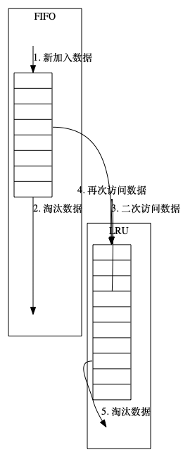

# 从零开始的LRU

## 1. 什么是[LRU][1]

LRU是Least Recently Used的缩写,即最近最少使用,是一种页面置换算法,选择最近最久未使用的页面予以淘汰.
该算法赋予每个页面一个访问字段,用来记录一个页面自上次被访问以来所经历的时间t,当须淘汰一个页面时,选择现有页面中t最大的,
即最近最少使用的页面予以淘汰.

## 2. 为什么需要LRU

在进程运行过程中，若其所要访问的页面不在内存而需把它们调入内存，但内存已无空闲空间时，为了保证该进程能正常运行，系统必须从内存中调出一页程序或数据送磁盘的对换区中。但应将哪个页面调出，须根据一定的算法来确定。通常，把选择换出页面的算法称为页面置换算法(Page-Replacement Algorithms)。 置换算法的好坏， 将直接影响到系统的性能。一个好的页面置换算法，应具有较低的页面更换频率。从理论上讲，应将那些以后不再会访问的页面换出，或把那些在较长时间内不会再访问的页面调出。存在着许多种置换算法，它们都试图更接近于理论上的目标。

LRU 置换算法虽然是一种比较好的算法，它可以很好的近似于理论性能最佳的OPT算法(实际上极难实现).这是LRU被开发出来的直接原因.

## 3. LRU的工作机制



`LRU原理示意图`

如图所示(虽然丑但是凑活一下),LRU主要通过链表和hashmap协同进行工作.

主要步骤分为以下3步.

3.1 **新数据插入到链表头部**;

3.2 **每当缓存命中(即缓存数据被访问),则将数据移到链表头部**;

3.3 **当链表满的时候, 将链表尾部的数据丢弃**.


## LRU实现的具体过程

```CPP

class LRUCache {
    public:
    struct CacheEntry
    {
        public:
            int key;
            int value;
            CacheEntry(int k,int v): key(k), value(v){}
    };
    LRUCache(int capacity){
        m_capacity = capacity;
    }  
    int get(int key){
        if(m_map.find(key) == m_map.end()){
            return -1;
        }
        MoveToHead(key);
        return m_map[key]->value;
    }
    void set(int key,int value){
        if(m_map.find(key) == m_map.end()){
            // key not in map
            CacheEntry newItem(key,value);
            if(m_LRU_cache.size() >= m_capacity){
                // when cache size is much more than capacity,
                // we should delete the last item from map and linkedlist.
                m_map.erase(m_LRU_cache.back().key);
                m_LRU_cache.pop_back();
            }

            m_LRU_cache.push_front(newItem);
            m_map[key] = m_LRU_cache.begin();
            return;
        }

        m_map[key]->value = value;
        MoveToHead(key);
    }
    private:
        unordered_map<int, list<CacheEntry>::iterator> m_map;
        list<CacheEntry> m_LRU_cache;
        int m_capacity;
        void MoveToHead(int key){
            auto updateEntry = *m_map[key];
            m_LRU_cache.erase(m_map[key]);
            m_LRU_cache.push_front(updateEntry);
            m_map[key] = m_LRU_cache.begin();
        }
};
```
## 4. 
参考资料

1. [百度LRU词条](https://baike.baidu.com/item/LRU/1269842?fr=aladdin)
2. [咸鱼专场!知乎](https://zhuanlan.zhihu.com/p/34989978)
3. [编程谜题]()

[1]: https://baike.baidu.com/item/LRU/1269842?fr=aladdin